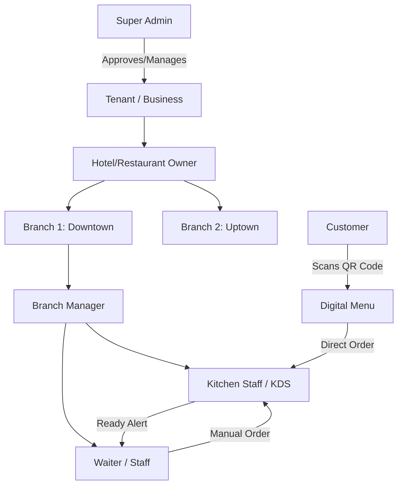

# Comprehensive User Guidelines & Operational Manual
## Hotel & Restaurant Management System (RMS)

Welcome to the official user guide for the **Hotel and Restaurant Management System (RMS)**. This document provides complete operational guidelines for all platform user roles—including Super Administrators, Business Owners, Branch Managers, Kitchen Chefs, Waiters, Cashiers, and Customers using the QR Digital Menu.

---

## 📋 Table of Contents
1. [System Overview & Architecture](#1-system-overview--architecture)
2. [Account Registration & Password Policies](#2-account-registration--password-policies)
3. [Roles & Permissions Matrix](#3-roles--permissions-matrix)
4. [Super Administrator Portal Guide](#4-super-administrator-portal-guide)
5. [Hotel & Restaurant Owner (`HOTEL_OWNER`) Guide](#5-hotel--restaurant-owner-hotel_owner-guide)
6. [Branch Manager (`RESTAURANT_MANAGER`) Guide](#6-branch-manager-restaurant_manager-guide)
7. [Kitchen Display System (KDS) Operational Manual](#7-kitchen-display-system-kds-operational-manual)
8. [Waiter & POS Operations Guide](#8-waiter--pos-operations-guide)
9. [Customer QR Digital Menu Guide](#9-customer-qr-digital-menu-guide)
10. [Troubleshooting & Frequently Asked Questions (FAQ)](#10-troubleshooting--frequently-asked-questions-faq)

---

## 1. System Overview & Architecture

The **Hotel & Restaurant Management System (RMS)** is a multi-tenant, multi-branch SaaS platform designed to streamline restaurant and hotel operations.



### Key Core Capabilities
- **Multi-Tenant Isolation**: Complete data privacy for each restaurant/hotel enterprise.
- **Multi-Branch Control**: Central management of multiple locations, local pricing, and inventory.
- **Role-Based Access Control (RBAC)**: Strict permissions governing who can perform actions.
- **Live Kitchen Display System (KDS)**: Interactive screen for kitchen staff to track and complete orders in real time.
- **QR Digital Menu**: Contactless ordering directly from dining tables.
- **Automated Password & Account Recovery**: Password reset powered by EmailJS integration.

---

## 2. Account Registration & Password Policies

Understanding how accounts are registered and authenticated ensures smooth onboarding for business owners and staff.

### 2.1 Self-Registered Tenants (Public Registration)
When a business owner registers via the public signup page (`/register`):
1. **Step 1: Account Info**: Provide Full Name, Business Email, Phone Number, and **Custom Password**.
2. **Step 2: Business Profile**: Provide Business Name, Type (Restaurant, Coffee Shop, Fast Food), Subdomain, and Currency.
3. **Step 3: Subscription Plan**: Choose a trial or paid plan.
4. **Approval Workflow**:
   - Newly created tenants receive status `PENDING`.
   - Once a **Super Admin** approves the application in the Admin Portal, the tenant status becomes `ACTIVE`.
   - > [!IMPORTANT]
   - > **Password Rule**: Self-registered tenants **retain their custom password** chosen during registration. They log in with their email and custom password immediately upon admin approval.

### 2.2 Super Admin-Created Tenants
When a Super Admin manually creates a tenant from `/dashboard/tenants`:
- The system generates an initial user account for the tenant.
- > [!NOTE]
- > **Password Rule**: Admin-created tenants are initialized with the default fallback password: `Welcome@1234`. The tenant owner should change this password upon first login.

### 2.3 Staff / Employee Account Creation
- **Created By**: Owners or Managers under `/dashboard/employees`.
- Credentials provided during employee creation are sent to the employee.

### 2.4 Forgot Password & Account Recovery
If any user forgets their login password:
1. Navigate to the Login Page (`/login`) and click **"Forgot Password?"**.
2. Enter your registered email address in the modal.
3. An automated password reset link is delivered to your inbox via EmailJS.
4. Follow the email link to securely enter a new password.

---

## 3. Roles & Permissions Matrix

| Role Code | Description | Key Capabilities | Restricted Actions |
| :--- | :--- | :--- | :--- |
| `SUPER_ADMIN` | Platform Super Administrator | Full control across all tenants, platform settings, approving/suspending tenants, plans, audit logs. | N/A |
| `HOTEL_OWNER` | Business Enterprise Owner | Full control over tenant business, multi-branch setup, master menu catalog, creating Managers & Staff. | Super Admin settings |
| `HOTEL_MANAGER` / `RESTAURANT_MANAGER` | Branch Operations Manager | Branch menu management, inventory overrides, onboarding Chefs/Waiters/Cashiers, table routing. | **Cannot create Manager accounts** or alter platform plans |
| `CHEF` | Kitchen Staff | View Kitchen Display System (KDS), update ticket status (`PENDING` $\rightarrow$ `PREPARING` $\rightarrow$ `READY` $\rightarrow$ `COMPLETED`). | Branch settings, staff management |
| `WAITER` | Service & Floor Staff | View assigned tables, take table orders, receive dish-ready alerts, initiate checkout. | Menu pricing, KDS management |
| `CASHIER` | Billing & Checkout Staff | Process order payments, issue receipts, close dining tabs. | Staff creation, system config |
| `CUSTOMER` | Restaurant Guest | Scan table QR code, browse catalog, customize items, submit orders directly to KDS. | Backend access |

---

## 4. Super Administrator Portal Guide

**Access Path**: Login with `SUPER_ADMIN` credentials $\rightarrow$ Redirects to `/dashboard/tenants`.

```
                  ┌───────────────────────────────┐
                  │ Super Admin Tenant Management │
                  └───────────────┬───────────────┘
                                  │
         ┌────────────────────────┼────────────────────────┐
         ▼                        ▼                        ▼
┌──────────────────┐    ┌──────────────────┐    ┌──────────────────┐
│ Approve Pending  │    │ Suspend / Ban    │    │ Delete Tenant    │
│  Applications    │    │ Active Business  │    │  (Cascade Wipe)  │
└──────────────────┘    └──────────────────┘    └──────────────────┘
```

### 4.1 Managing Tenant Applications
- **Review Pending Applications**: Navigate to `/dashboard/tenants`. Filter by `PENDING`.
- **Approve Tenant**: Click **"Approve"**. Status changes to `ACTIVE`. Tenant receives approval confirmation and can log in with their custom password.
- **Reject Tenant**: Click **"Reject"** to decline applications.

### 4.2 Tenant Lifecycle Management
- **Suspend Tenant**: Temporarily block tenant logins by clicking **"Suspend"**. Tenant users attempting login will receive an *Account Suspended* warning.
- **Activate Tenant**: Restore access for suspended tenants by clicking **"Activate"**.
- **Delete Tenant**: Click **"Delete"** to permanently remove a tenant.
  - > [!WARNING]
  - > Deleting a tenant performs a **full cascade deletion**, wiping all associated users, branches, menu items, orders, tables, and subscription logs.

---

## 5. Hotel & Restaurant Owner (`HOTEL_OWNER`) Guide

**Access Path**: `/dashboard`

### 5.1 Setting Up Branches
1. Navigate to **Branches** (`/dashboard/branches`).
2. Click **"Add New Branch"**.
3. Enter branch details (Branch Name, Location/Address, Contact Phone, Operating Hours).
4. Save to establish a local branch context.

### 5.2 Master Menu & Category Catalog
1. Navigate to **Menu Management** (`/dashboard/menu`).
2. Create Categories (e.g., *Appetizers*, *Main Courses*, *Beverages*, *Desserts*).
3. Add Master Menu Items with title, description, image, base price, and tags (e.g., *Vegetarian*, *Spicy*).
4. Synchronize Master Menu items to selected active branches.

### 5.3 Onboarding Branch Managers & Staff
1. Navigate to **Employee Management** (`/dashboard/employees`).
2. Click **"Add Employee"**.
3. Select Role: `RESTAURANT_MANAGER` (or `HOTEL_MANAGER`).
4. Select the Branch to assign the manager to.
5. Fill in employee credentials and submit.
   - > [!TIP]
   - > **Manager Creation Privilege**: Only `HOTEL_OWNER` (or `SUPER_ADMIN`) accounts have permission to create Manager accounts.

---

## 6. Branch Manager (`RESTAURANT_MANAGER`) Guide

**Access Path**: `/dashboard` (Scoped to assigned branch)

### 6.1 Creating Non-Manager Staff (Chefs, Waiters, Cashiers)
1. Navigate to **Employees** (`/dashboard/employees`).
2. Click **"Add Employee"**.
3. Select Role: `WAITER`, `CHEF`, or `CASHIER`.
4. Enter name, email, phone number, and password.

### 6.2 Assigning Tables to Waiters
When creating or editing a `WAITER` employee:
1. Open the **Employee Form Modal**.
2. Scroll to **Assigned Tables**.
3. The table dropdown will display available dining tables for your branch.
   - > [!IMPORTANT]
   - > **Table Conflict Prevention**: Tables that are **already assigned to another waiter** in your branch are automatically filtered out. This guarantees clear responsibility and prevents overlapping waiter table assignments.

---

## 7. Kitchen Display System (KDS) Operational Manual

The Kitchen Display System (KDS) gives kitchen chefs an interactive, real-time board to manage ticket orders.

**Access Path**: `/dashboard/kitchen`

```
┌────────────────────────────────────────────────────────────────────────┐
│                        Kitchen Display System                          │
├──────────────────┬──────────────────────┬──────────────────────────────┤
│ 🟡 PENDING       │ 🔵 PREPARING         │ 🟢 READY                     │
│ [Order #101]     │ [Order #100]         │ [Order #99]                  │
│ Table 4 • 2 items│ Table 2 • 3 items    │ Table 1 • 1 item             │
│                  │                      │                              │
│ [Start Preparing]│ [Mark Order Ready]   │ [Complete & Clear Ticket]    │
└──────────────────┴──────────────────────┴──────────────────────────────┘
```

### 7.1 Interactive Ticket Workflow
Each incoming ticket displays order details, table number, elapsed timer, and dish items.

1. **Step 1: Incoming Order (`PENDING`)**
   - New orders arrive on the board as **Pending** (Yellow border).
   - Click the **"Start Preparing"** button.
   - *Status update*: Ticket transitions to `PREPARING` state.

2. **Step 2: Food Preparation (`PREPARING`)**
   - Active ticket highlights as **Preparing** (Blue border) with live preparation timer.
   - When dishes are finished, click the **"Mark Order Ready"** button.
   - *Status update*: Ticket transitions to `READY` state. Waiter terminals receive a ready notification.

3. **Step 3: Food Picked Up / Handed Off (`READY`)**
   - Completed dishes wait under **Ready** (Green border).
   - Once waiter/staff picks up food, click **"Complete & Clear Ticket"**.
   - *Status update*: Order status becomes `COMPLETED` and ticket clears from the active KDS display.

### 7.2 Kitchen Tools & Controls
- **Filter by Status**: View `ALL`, `PENDING`, `PREPARING`, or `READY` orders.
- **Print Ticket**: Click the **Printer Icon** on any order card to print a physical paper kitchen chit.
- **Audio Alerts**: Enable audio chimes for instant notifications when new customer/waiter orders arrive.

---

## 8. Waiter & POS Operations Guide

**Access Path**: `/dashboard/orders` or Waiter Mobile Interface

### 8.1 Dining Room & Floor View
- View color-coded floor map:
  - 🟢 **Free Table**: Available for new guests.
  - 🔴 **Occupied Table**: Guests seated, active dining tab open.
  - 🟡 **Order Pending / Served**: Food currently being prepared or delivered.

### 8.2 Taking an Order
1. Select a table assigned to you.
2. Select menu items requested by guests.
3. Add item customizations (e.g., *"No onions"*, *"Extra spicy"*).
4. Click **"Fire Order to Kitchen"**.
5. Order immediately registers on the Kitchen KDS board.

### 8.3 Dish-Ready Notifications & Billing
- When the Kitchen Staff marks an order as `READY`, your waiter interface flashes a notification.
- Serve dishes to the designated table.
- When guests are ready to pay, open table tab, review total, select payment method (Cash/Card/Digital), and click **"Complete Checkout"**.

---

## 9. Customer QR Digital Menu Guide

Guests can place orders directly from their smartphone without downloading an app.

```
       [ Customer Phone ]
               │
               ▼  Scans Table QR Code
      ┌──────────────────┐
      │ Public Digital   │
      │  Restaurant Menu │
      └────────┬─────────┘
               │ Selects Items & Customizations
               ▼
      ┌──────────────────┐
      │  Submit Order    │
      └────────┬─────────┘
               │ Direct Push
               ▼
    [ Restaurant KDS & POS ]
```

### 9.1 Scanning & Ordering Workflow
1. **Scan QR Code**: Guest uses smartphone camera to scan the QR code located on their dining table.
2. **Browse Menu**: Responsive catalog opens automatically (`/menu?tenantId=...&tableId=...`). Guests browse categories, photos, prices, and dietary tags.
3. **Cart Customization**: Add items to cart with special instructions (allergies, beverage preferences).
4. **Place Order**: Click **"Submit Order"**.
5. **Track Status Live**: Phone screen displays a live status ticket:
   - ⏳ *Order Received*
   - 🔥 *Chef is Preparing your Meal*
   - ✅ *Food is Ready / On its Way!*

---

## 10. Troubleshooting & Frequently Asked Questions (FAQ)

### Q1: Why can't a self-registered tenant log in after registration?
> **Answer**: Newly registered tenants must be approved by a **Super Admin**. Check that the tenant status is `ACTIVE` in `/dashboard/tenants`. Also note that self-registered tenants use the **custom password** entered during sign-up.

### Q2: Why does an admin-created tenant login fail with their custom password?
> **Answer**: Accounts created directly inside the Super Admin panel are initialized with default password `Welcome@1234`. The user should log in with `Welcome@1234` and update their password in profile settings.

### Q3: Why doesn't a table appear in the dropdown when adding a new waiter?
> **Answer**: The system enforces **strict single-waiter table assignment**. If a table is missing from the list, it is already assigned to another waiter in the branch. Edit the existing waiter to unassign the table if you wish to reassign it.

### Q4: Why can't a Branch Manager create another Manager account?
> **Answer**: Security policy restricts manager creation. Only `HOTEL_OWNER` or `SUPER_ADMIN` accounts possess permissions to create `RESTAURANT_MANAGER` or `HOTEL_MANAGER` accounts.

### Q5: How do I recover a lost password?
> **Answer**: Click **"Forgot Password?"** on the login page, enter your registered email, and follow the link sent to your inbox via EmailJS to set a new password.

---
*End of User Guidelines Documentation.*
